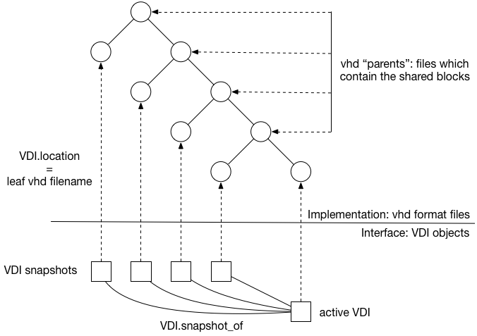
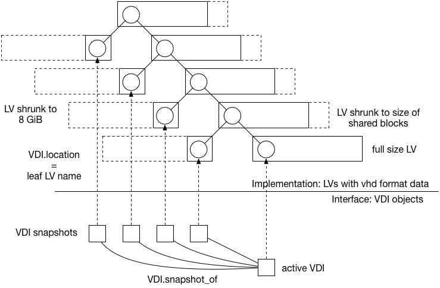
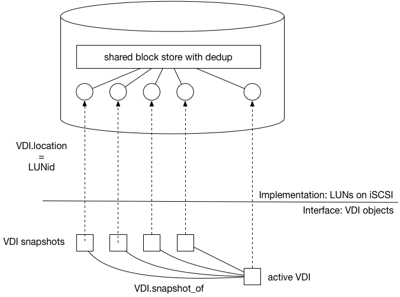
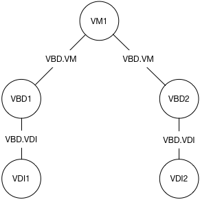
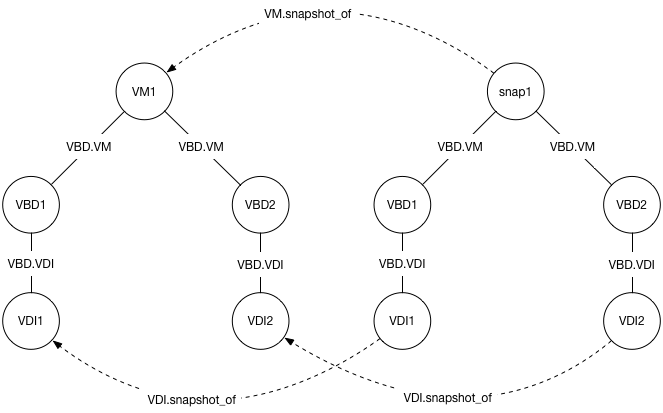
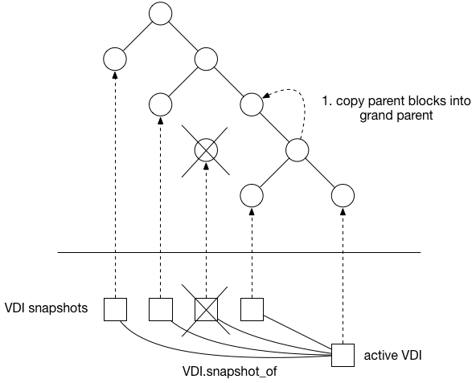
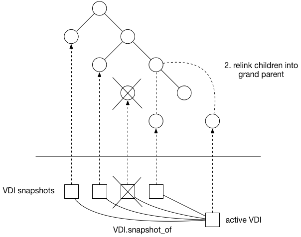
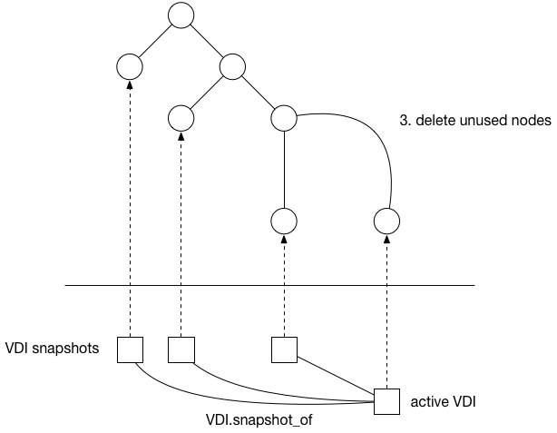

Snapshots represent the state of a VM, or a disk (VDI) at a point in time. They can be used for:

- backups (hourly, daily, weekly etc)
- experiments (take snapshot, try something, revert back again)
- golden images (install OS, get it just right, clone it 1000s of times)

Read more about [the Snapshot APIs](../../xen-api/snapshots.html).

Disk snapshots
==============

Disks are represented in the XenAPI as VDI objects. Disk snapshots are represented
as VDI objects with the flag `is_a_snapshot` set to true. Snapshots are always
considered read-only, and should only be used for backup or cloning into new
disks. Disk snapshots have a lifetime independent of the disk they are a snapshot
of i.e. if someone deletes the original disk, the snapshots remain. This contrasts
with some storage arrays in which snapshots are "second class" objects which are
automatically deleted when the original disk is deleted.

Disks are implemented in Xapi via "Storage Manager" (SM) plugins. The SM plugins
conform to an api (the SMAPI) which has operations including

- vdi_create: make a fresh disk, full of zeroes
- vdi_snapshot: create a snapshot of a disk


File-based vhd implementation
=============================

The existing "EXT" and "NFS" file-based Xapi SM plugins store disk data in
trees of .vhd files as in the following diagram:



From the XenAPI point of view, we have one current VDI and a set of snapshots,
each taken at a different point in time. These VDIs correspond to leaf vhds in
a tree stored on disk, where the non-leaf nodes contain all the shared blocks.

The vhd files are always thinly-provisioned which means they only allocate new
blocks on an as-needed basis. The snapshot leaf vhd files only contain vhd
metadata and therefore are very small (a few KiB). The parent nodes containing
the shared blocks only contain the shared blocks. The current leaf initially
contains only the vhd metadata and therefore is very small (a few KiB) and will
only grow when the VM writes blocks.

File-based vhd implementations are a good choice if a "gold image" snapshot
is going to be cloned lots of times.

Block-based vhd implementation
==============================

The existing "LVM", "LVMoISCSI" and "LVMoHBA" block-based Xapi SM plugins store
disk data in trees of .vhd files contained within LVM logical volumes:



Non-snapshot VDIs are always stored full size (a.k.a. thickly-provisioned).
When parent nodes are created they are automatically shrunk to the minimum size
needed to store the shared blocks. The LVs corresponding with snapshot VDIs
only contain vhd metadata and by default consume 8MiB. Note: this is different
to VDI.clones which are stored full size.

Block-based vhd implementations are not a good choice if a "gold image" snapshot
is going to be cloned lots of times, since each clone will be stored full size.

Hypothetical LUN implementation
===============================

A hypothetical Xapi SM plugin could use LUNs on an iSCSI storage array
as VDIs, and the array's custom control interface to implement the "snapshot"
operation:



From the XenAPI point of view, we have one current VDI and a set of snapshots,
each taken at a different point in time. These VDIs correspond to LUNs on the
same iSCSI target, and internally within the target these LUNs are comprised of
blocks from a large shared copy-on-write pool with support for dedup.

Reverting disk snapshots
========================

There is no current way to revert in-place a disk to a snapshot, but it is
possible to create a writable disk by "cloning" a snapshot.

VM snapshots
============

Let's say we have a VM, "VM1" that has 2 disks. Concentrating only
on the VM, VBDs and VDIs, we have the following structure:



When we take a snapshot, we first ask the storage backends to snapshot
all of the VDIs associated with the VM, producing new VDI objects.
Then we copy all of the metadata, producing a new 'snapshot' VM
object, complete with its own VBDs copied from the original, but now
pointing at the snapshot VDIs. We also copy the VIFs and VGPUs
but for now we will ignore those.

This process leads to a set of objects that look like this:



We have fields that help navigate the new objects: ```VM.snapshot_of```,
and ```VDI.snapshot_of```. These, like you would expect, point to the
relevant other objects.

Deleting VM snapshots
=====================

When a snapshot is deleted Xapi calls the SM API `vdi_delete`. The Xapi SM
plugins which use vhd format data do not reclaim space immediately; instead
they mark the corresponding vhd leaf node as "hidden" and, at some point later,
run a garbage collector process.

The garbage collector will first determine whether a "coalesce" should happen i.e.
whether any parent nodes have only one child i.e. the "shared" blocks are only
"shared" with one other node. In the following example the snapshot delete leaves
such a parent node and the coalesce process copies blocks from the redundant
parent's only child into the parent:



Note that if the vhd data is being stored in LVM, then the parent node will
have had to be expanded to full size to accommodate the writes. Unfortunately
this means the act of reclaiming space actually consumes space itself, which
means it is important to never completely run out of space in such an SR.

Once the blocks have been copied, we can now cut one of the parents out of the
tree by relinking its children into their grandparent:



Finally the garbage collector can remove unused vhd files / LVM LVs:



Reverting VM snapshots
======================

The XenAPI call `VM.revert` overwrites the VM metadata with the snapshot VM
metadata, deletes the current VDIs and replaces them with clones of the
snapshot VDIs. Note there is no "vdi_revert" in the SMAPI.

Revert implementation details
-----------------------------

This is the process by which we revert a VM to a snapshot. The
first thing to notice is that there is some logic that is called
from [message_forwarding.ml](https://github.com/xapi-project/xen-api/blob/ce6d3f276f0a56ef57ebcf10f45b0f478fd70322/ocaml/xapi/message_forwarding.ml#L1528),
which uses some low-level database magic to turn the current VM
record into one that looks like the snapshot object. We then go
to the rest of the implementation in [xapi_vm_snapshot.ml](https://github.com/xapi-project/xen-api/blob/ce6d3f276f0a56ef57ebcf10f45b0f478fd70322/ocaml/xapi/xapi_vm_snapshot.ml#L403).
First,
we shut down the VM if it is currently running. Then, we revert
all of the [VBDs, VIFs and VGPUs](https://github.com/xapi-project/xen-api/blob/ce6d3f276f0a56ef57ebcf10f45b0f478fd70322/ocaml/xapi/xapi_vm_snapshot.ml#L270).
To revert the VBDs, we need to deal with the VDIs underneath them.
In order to create space, the first thing we do is [delete all of
the VDIs](https://github.com/xapi-project/xen-api/blob/ce6d3f276f0a56ef57ebcf10f45b0f478fd70322/ocaml/xapi/xapi_vm_snapshot.ml#L287) currently attached via VBDs to the VM.
We then _clone_ the disks from the snapshot. Note that there is
no SMAPI operation 'revert' currently - we simply clone from
the snapshot VDI. It's important to note that cloning
creates a _new_ VDI object: this is not the one we started with gone.
